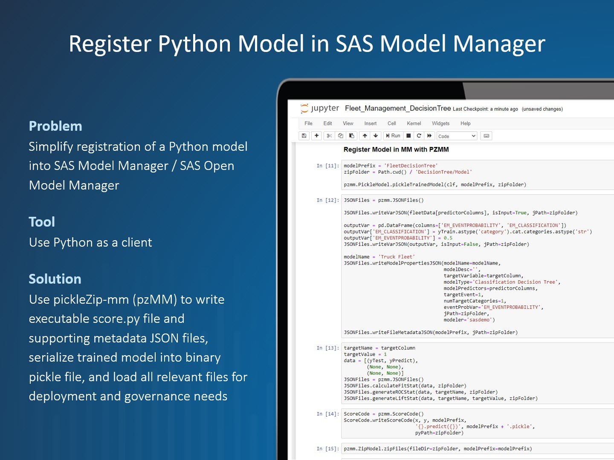

# pzmm Module

## Overview

The goal of the pzmm (Python Zip Model Management) module is to enable users of SAS Model Manager on SAS Viya and SAS Open Model Manager to zip through the process of importing Python models into the common model repository. In order to facilitate model imports, the module allows the user to complete the following tasks:

* Writes JSON files to read in the model information, which includes the following files:
  * `fileMetadata.json` specifies the file roles for the names of the input and output variables files, the Python score code file, and the Python pickle file
  * `ModelProperties.json` is used to set the model properties that are read during the import process
  * `inputVar.json` and `outputVar.json` are used to set the input and output variables of the model
  * `dmcas_fitstat.json` is an optional file that provides the fit statistics that are associated with the imported model, which are either user-generated or data-generated
  * `dmcas_lift.json` and `dmcas_roc.json` are optional files that provide the Lift and ROC plots that are associated with the imported model, which are data-generated
* Writes the `*score.py` model file that is used for model scoring
* Serializes a trained model into a binary pickle file or saves a relevant H2O MOJO file
* Archives all relevant model files into a ZIP file and imports the model using REST API calls

## Prerequisites

Use of this package requires the following:

* Python version 3+
  * Automatic generation of score code is limited to Python >= 3.6 (this functionality will be backported to Python 3+ in future releases)
* SAS Viya 3.5+ environment or SAS Open Model Manager 1.2+ and user credentials
* External Python libraries:
  * scipy v1.4.0+
  * scikit-learn v0.22.1+
  * pandas v0.25.3+
  * requests v2.23.0+

## Module Import

Importing the pzmm module is done by running the following line in Python after installation of the python-sasctl package:

`import sasctl.pzmm as pzmm`

## Demos

The following demo video walks through the process of importing a Python model in SAS Model Manager in SAS Viya and shows most of the current features of pzmm. The notebook from the demo is called FleetManagement.ipynb and can be found in the [examples folder here.](../../../examples/FleetManagement.ipynb)

## License

This project is licensed under the [Apache 2.0 License](/LICENSE).

